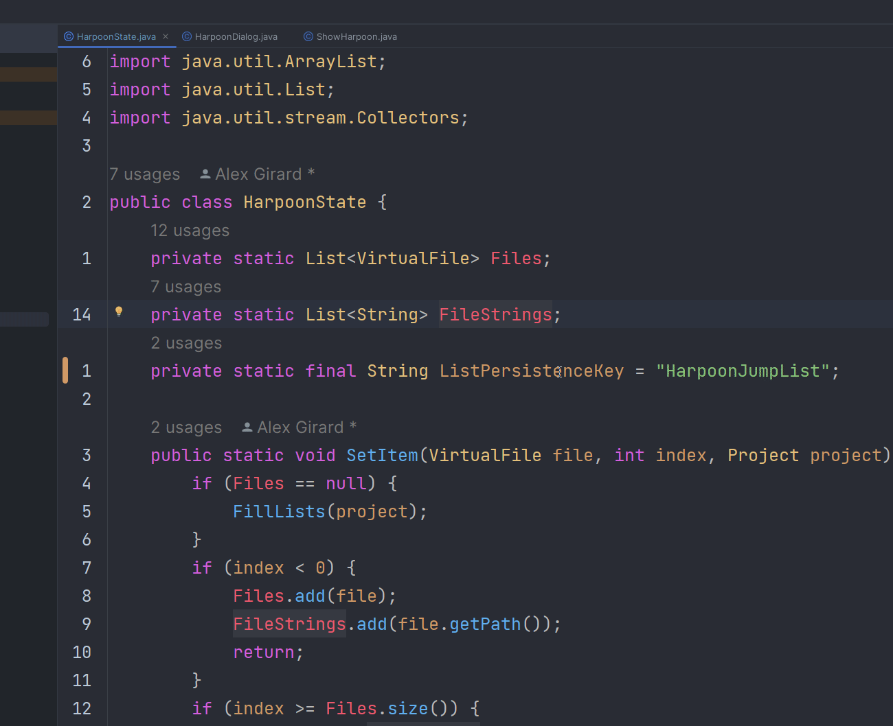

<div style="text-align: center;">

# HarpoonIJ
[](https://plugins.jetbrains.com/plugin/20782-harpoonij)
[](https://plugins.jetbrains.com/plugin/20782-harpoonij)

HarpoonIJ is a port of the NeoVim Extension [Harpoon](https://github.com/ThePrimeagen/harpoon) created by [ThePrimeagen](https://twitter.com/ThePrimeagen).This plugin enhances your coding workflow by allowing quick navigation to frequently-used files through hotkeys and a popup dialog.
</div>

## Features

- **Quick File Access**: Pin files to numbered slots and jump straight to the first five by hotkey.
- **Popup Dialog**: View and manage your pinned files in a popup. It is an ordinary editor, so you
  edit the list in place — reorder lines, delete them — and the list is saved when the popup closes.
  Note that saving the popup re-packs the list: blank lines are dropped and the remaining entries
  move up, so removing the second of five entries makes the third one slot 2.
- **Flexible Indexing**: Assign a file to a specific slot, or add it to the first empty one. The list
  itself is not capped at five; only the direct-jump hotkeys are.
- **Enter to Navigate**: With IdeaVim installed, press Enter on an entry to open it immediately.



## Using it with IdeaVim

IdeaVim is optional but is what this plugin is built for. With it installed, the popup is a real Vim
buffer: it opens in normal mode on the first entry, `j`/`k` walk the list, the usual editing commands
(`dd`, `p`, …) work on it, Enter opens the entry under the caret, and Escape closes the popup.

Without IdeaVim the popup is a plain text editor and the Enter mapping is unavailable; everything
else works, driven from the `Tools > Harpoon` menu or from IDE keymap bindings.

## Commands

- `ShowHarpoon`: Displays the Harpoon dialog.
- `GotoHarpoon[1-5]`: Navigates to the file saved at the specified index.
- `SetHarpoon[1-5]`: Assigns the current file to a specific index.
- `AddToHarpoon`: Adds the current file to the first available empty index.
- `NextHarpoonItem` / `PreviousHarpoonItem`: Move the selection down/up while the dialog is open.
- `SelectHarpoonItem`: Opens the entry currently selected in the dialog.

The last three only do anything while the dialog is on screen. All of these are also on the
`Tools > Harpoon` menu, except the three dialog-only ones.

## Configuration

You can customize HarpoonIJ to better fit your workflow through the following settings:

- **Popup Width**: Adjust the width of the popup dialog.
- **Popup Height**: Adjust the height of the popup dialog.
- **Popup Font Size**: Set the font size for text within the popup dialog.
- **Map Enter to Select Item in Dialog**: If you have IdeaVim installed, enabling this will allow you to select an item in the dialog by pressing Enter. Turn it off to leave `<cr>` to your own mapping.

To access these settings, navigate to `File > Settings > Tools > HarpoonIJ Settings`.

## Hotkeys

By default, there are no pre-configured hotkeys. The plugin is built with the intention of being used alongside IdeaVim, so all keybindings can be set in an `ideavimrc` file.

### ideavimrc (`_ideavimrc`)

```vimrc
nmap <leader><C-h> :action SetHarpoon1<cr>
nmap <leader><C-t> :action SetHarpoon2<cr>
nmap <leader><C-n> :action SetHarpoon3<cr>
nmap <leader><C-s> :action SetHarpoon4<cr>

nmap <C-h> :action GotoHarpoon1<cr>
nmap <C-t> :action GotoHarpoon2<cr>
nmap <C-n> :action GotoHarpoon3<cr>
nmap <C-s> :action GotoHarpoon4<cr>

nmap <C-e> :action ShowHarpoon<cr>
nmap <C-a> :action AddToHarpoon<cr>
```

## Contributing

See [development.md](development.md) for how to build, test and run the plugin, and
[AGENTS.md](AGENTS.md) for how it is put together and the sharp edges worth knowing before you
change anything.
