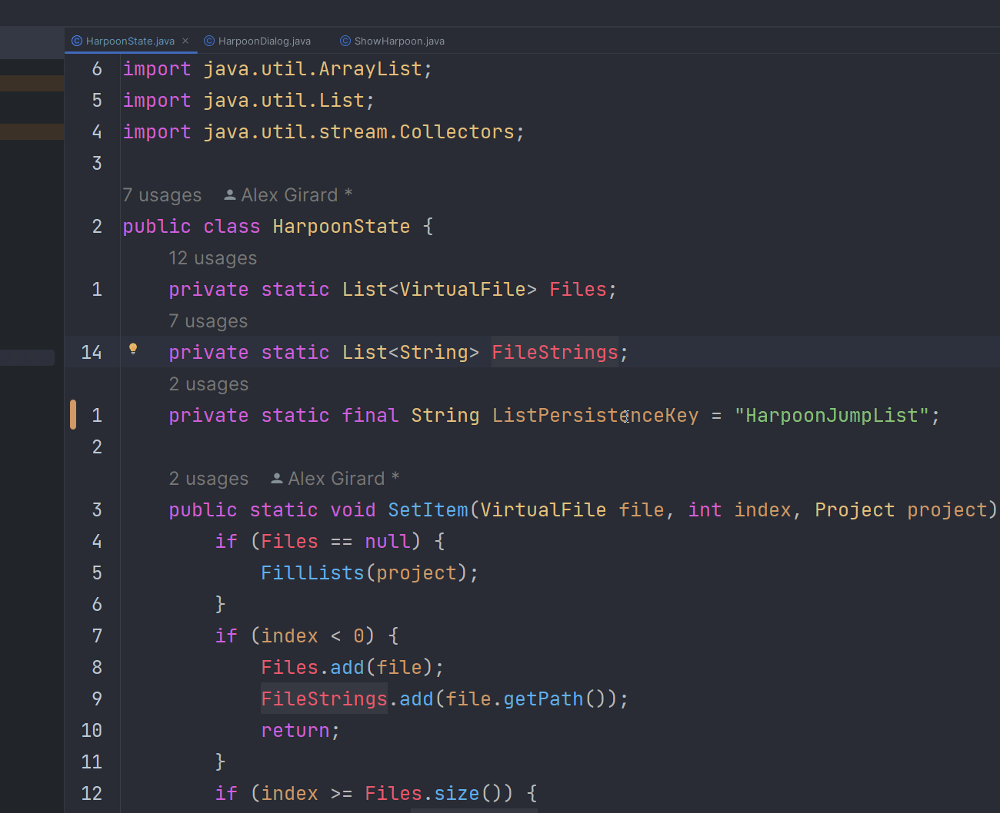

<div style="text-align: center;">

# HarpoonIJ
[](https://plugins.jetbrains.com/plugin/20782-harpoonij)
[](https://plugins.jetbrains.com/plugin/20782-harpoonij)

HarpoonIJ is a port of the NeoVim Extension [Harpoon](https://github.com/ThePrimeagen/harpoon) created by [ThePrimeagen](https://twitter.com/ThePrimeagen).This plugin enhances your coding workflow by allowing quick navigation to frequently-used files through hotkeys and a popup dialog.
</div>

## Features

- **Quick File Access**: Mark up to 5 files for quick navigation via hotkeys.
- **Popup Dialog**: View and manage your selected files in a convenient popup dialog.
- **Flexible Indexing**: Assign a file to a specific index or add it to the first available slot.
- **Enter to Navigate**: Select a file from the popup dialog and press Enter to navigate to it immediately.



## Commands

- `ShowHarpoon`: Displays the Harpoon dialog.
- `GotoHarpoon[1-5]`: Navigates to the file saved at the specified index.
- `SetHarpoon[1-5]`: Assigns the current file to a specific index.
- `AddToHarpoon`: Adds the current file to the first available empty index.

## Configuration

You can customize HarpoonIJ to better fit your workflow through the following settings:

- **Popup Width**: Adjust the width of the popup dialog.
- **Popup Height**: Adjust the height of the popup dialog.
- **Popup Font Size**: Set the font size for text within the popup dialog.
- **Force Dialog into Normal Mode**: If you have IdeaVim installed, enabling this option will force the dialog into Vim's Normal mode.
- **Map Enter to Select Item in Dialog**: If you have IdeaVim installed, enabling this will allow you to select an item in the dialog by pressing Enter.

To access these settings, navigate to `File > Settings > Tools > HarpoonIJ Settings`.

## Hotkeys

By default, there are no pre-configured hotkeys. The plugin is built with the intention of being used alongside IdeaVim, so all keybindings can be set in an `ideavimrc` file.

### ideavimrc (`_ideavimrc`)

```vimrc
nmap <leader><C-h> :action SetHarpoon1<cr>
nmap <leader><C-t> :action SetHarpoon2<cr>
nmap <leader><C-n> :action SetHarpoon3<cr>
nmap <leader><C-s> :action SetHarpoon4<cr>

nmap <C-h> :action GotoHarpoon1<cr>
nmap <C-t> :action GotoHarpoon2<cr>
nmap <C-n> :action GotoHarpoon3<cr>
nmap <C-s> :action GotoHarpoon4<cr>

nmap <C-e> :action ShowHarpoon<cr>
nmap <C-a> :action AddToHarpoon<cr>
